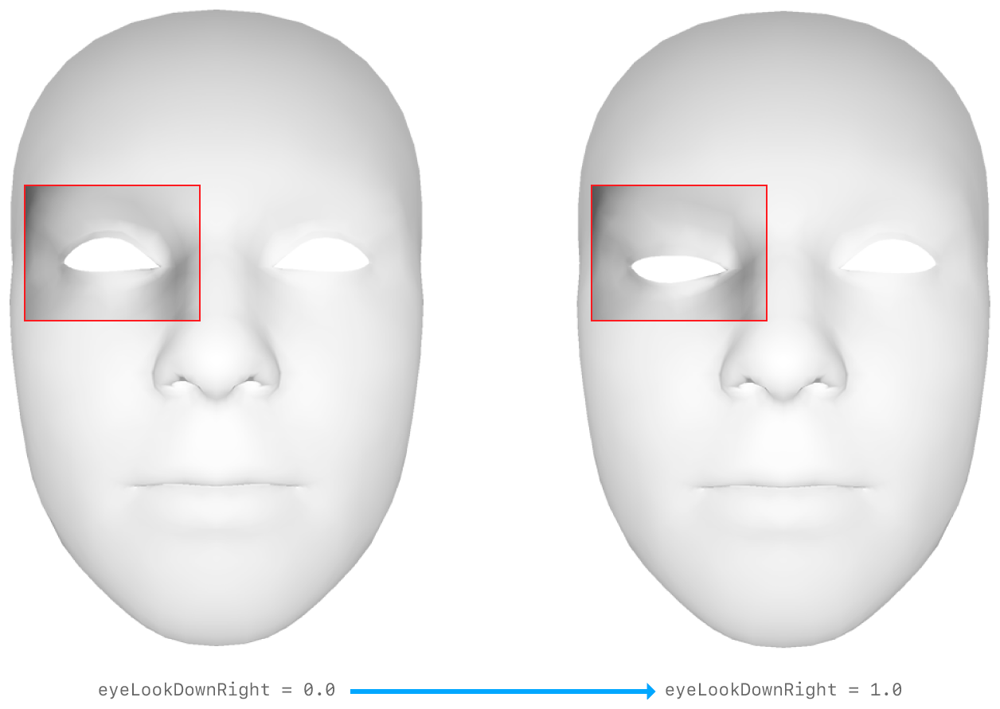
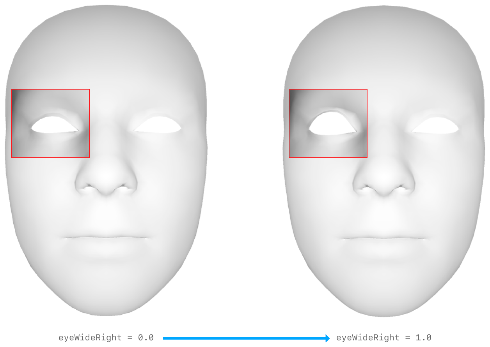
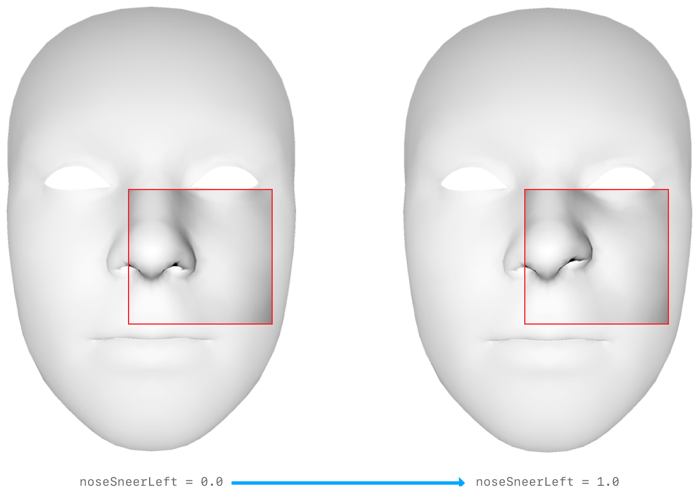
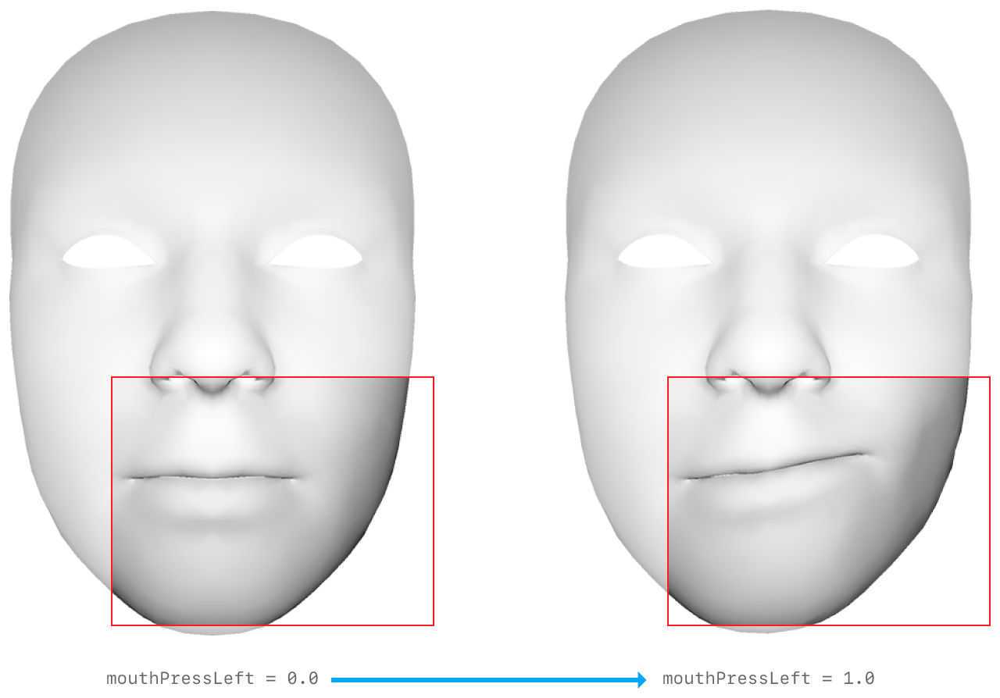
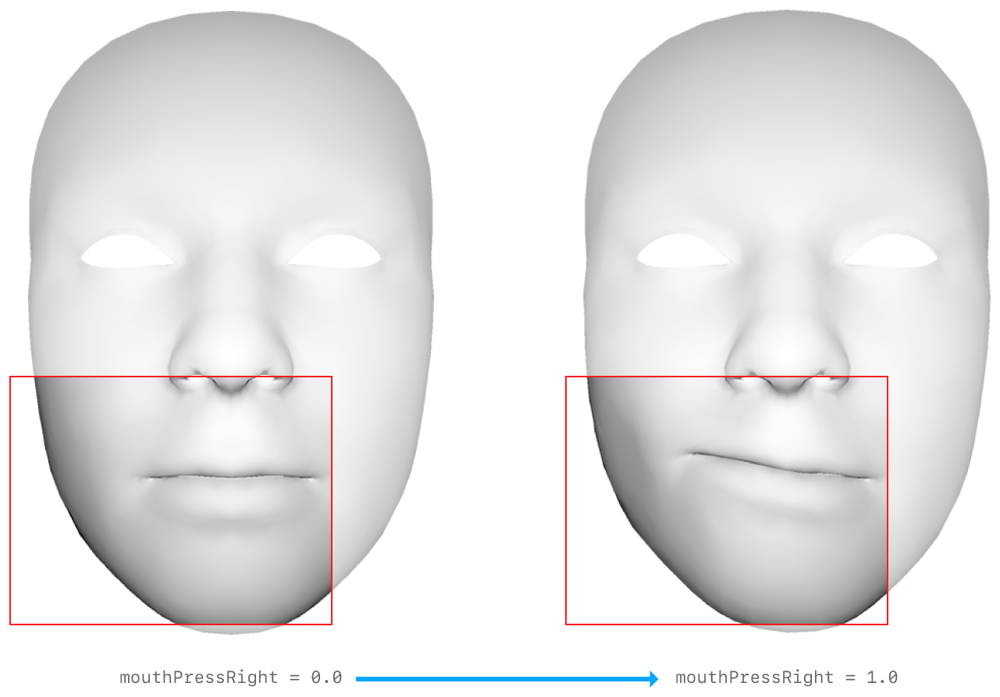

# ARKit Blendshapes
Resources: 
* https://developer.apple.com/documentation/arkit/arfaceanchor/blendshapes
* https://arkit-face-blendshapes.com/
  
## ARKit Blendshapes List & Table
Here is the complete list & table of all the 52 ARKit blendshapes used for facial animation:

### Non-duplicated blendshapes (12)

#### Eyebrows
  - browInnerUp 
    

#### Cheeks & Nose
  - cheekPuff 
    
    
#### Mouth
  - mouthFunnel 
    
  - mouthPucker 
    
  - mouthRollUpper 
    
  - mouthRollLower 
    
  - mouthShrugUpper 
    
  - mouthShrugLower 
    
  - mouthClose 
    

#### Jaw
  - jawOpen 
    
  - jawForward 
    

#### Tongue
  - tongueOut 
    

### Duplicated blendshapes (20*2)
| Left Blendshapes | Right Blendshapes |
|------------------|-------------------|
| **Eyebrows**     | **Eyebrows**      |
| browDownLeft  | browDownRight  |
| browOuterUpLeft  | browOuterUpRight  |
|                  |                   |
| **Eyes**         | **Eyes**          |
| eyeLookUpLeft  | eyeLookUpRight  |
| eyeLookDownLeft  | eyeLookDownRight  |
| eyeLookInLeft  | eyeLookInRight  |
| eyeLookOutLeft  | eyeLookOutRight  |
| eyeBlinkLeft  | eyeBlinkRight  |
| eyeSquintLeft  | eyeSquintRight  |
| eyeWideLeft  | eyeWideRight  |
|                  |                   |
| **Cheeks & Nose**| **Cheeks & Nose** |
| cheekSquintLeft  | cheekSquintRight  |
| noseSneerLeft  | noseSneerRight  |
|                  |                   |
| **Mouth**        | **Mouth**         |
| mouthLeft  | mouthRight  |
| mouthSmileLeft  | mouthSmileRight  |
| mouthFrownLeft  | mouthFrownRight  |
| mouthDimpleLeft  | mouthDimpleRight  |
| mouthUpperUpLeft  | mouthUpperUpRight  |
| mouthLowerDownLeft  | mouthLowerDownRight  |
| mouthPressLeft  | mouthPressRight  |
| mouthStretchLeft  | mouthStretchRight  |
|                  |                   |
| **Jaw**          | **Jaw**           |
| jawLeft  | jawRight  |
|                  |                   |
